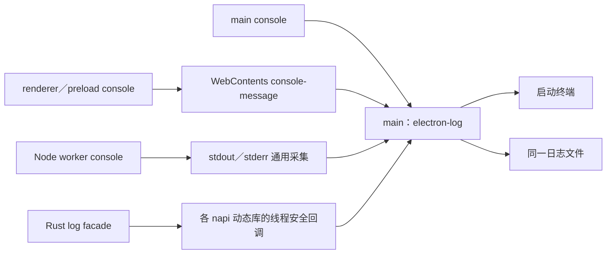

# 桌面日志

Electron main 统一输出 main、renderer／preload、Node worker 和 Rust 原生模块的日志，写入终端与同一文件。本文描述当前链路、存储行为和接入约定；日志查询与实例操作见 [manage-dev-instances](../.agent/skills/manage-dev-instances/SKILL.md)。Go 服务端日志与 HTTP 请求字段规则见 [HTTP 接口](../server/docs/http.md#请求日志)。

## 日志链路



main 使用 electron-log 的 Node 接口，在业务初始化前接管 console；不启用 electron-log 自动 IPC 或远程传输。main 与 renderer logger 在同一进程共享文件注册表并同步追加写入。

renderer 保留浏览器 console 和 DevTools 输出。main 通过窗口的 `console-message` 事件采集文本，镜像到终端和文件；不另建 renderer 日志 IPC，也不向 renderer 开放文件系统权限。复杂对象的文件表示受 Chromium 文本格式限制，需要完整结构时由业务显式序列化。

main 记录未捕获异常监测事件和未处理 Promise 拒绝；renderer 入口记录未处理 Promise 拒绝，main 记录渲染进程异常退出和 preload 加载失败。日志初始化前的失败可能只出现在启动终端。

## 文件、轮转与保留

日志目录由 [app/paths.ts](../desktop/src/main/app/paths.ts) 定义，为 `app.getPath("appData")/com.tctony.xiaowei/xiaowei/logs/`；Electron 的 `userData` 设置为其中的 `com.tctony.xiaowei` 目录。macOS 路径为 `~/Library/Application Support/com.tctony.xiaowei/xiaowei/logs/`。

开发与打包使用同一应用标识和目录，日志不按工作区或 tag 隔离。不能凭文件路径判断实例属于哪个工作区。

| 项目 | 当前行为 |
| --- | --- |
| 当天文件 | `YYYY-MM-DD-xiaowei.log`，日期使用本地时区 |
| 跨天 | 日期变化后的第一条日志切换到新文件 |
| 轮转 | 当天文件超过 20 MiB 后，在下一次写入前轮转；单条日志可能使文件超出阈值 |
| 备份命名 | `YYYY-MM-DD-xiaowei-HH-mm-ss-SSS.log`，使用轮转时的本地时间；重名追加 `-1`、`-2` 等序号，不覆盖备份 |
| 保留期限 | 今天及此前 14 个本地自然日，共 15 天；包括当天文件与轮转备份 |
| 清理时机 | 启动及日期变化后的第一次写入，按文件名日期清理 |

清理仅处理匹配上述命名的普通文件；不处理目录、符号链接、其他命名或旧版无日期日志。清理失败报告到原始终端，不递归写入日志。

文件同步写入。终端使用独立的 Node `Console({ ignoreErrors: true })`，忽略 stdout／stderr 的同步或异步写入失败，避免派生未捕获异常和重复日志；异常仍尝试输出到终端，文件输出继续正常执行。

## 等级与格式

开发态记录 debug 及以上，正式包记录 info 及以上；main 控制终端和文件过滤，DevTools console 保留浏览器原生行为。Rust trace 映射到 debug。

统一格式包含本地时间、级别、来源和正文；级别按 5 字符宽度左侧补空格：

```text
YYYY-MM-DD HH:mm:ss.SSS [ info] [main] [desktop/src/main/app/bootstrap.ts:行号] 正文
YYYY-MM-DD HH:mm:ss.SSS [error] [renderer] [desktop/src/renderer/src/main.tsx:行号] 正文
YYYY-MM-DD HH:mm:ss.SSS [debug] [worker.llm] [desktop/src/main/services/llm/worker/index.ts:行号] 正文
YYYY-MM-DD HH:mm:ss.SSS [ info] [main] [crates/xw-bookmark/src/store.rs:行号] 正文
```

Rust 日志来源为 main，接收器使用 target 过滤，但最终输出不重复附加 Rust 或 target 标记。没有源码位置时不补造位置。

终端整条日志按级别染色，包括对象和多行堆栈：debug／verbose／silly 灰色，info 默认色，warn 黄色，error 红色。自动检测 TTY，重定向时默认无颜色；可由 `FORCE_COLOR` 或 `NO_COLOR` 控制，文件始终为纯文本。

## TS 源码位置与调用

业务继续使用 `console.log/info/warn/error/debug/trace(...)`。`@xiaowei/source-log` 在构建时注入工作区相对路径和原始行号，路径使用 `/`；不在运行时抓栈或查询 source map。首参数为字符串时保留 `%s`、`%o`、`%c` 等占位符及后续参数；对象和 Error 仍交给原 console。

main、preload、renderer 和独立 main 构建脚本已接入 Vite 插件，Storybook 未启用。转换覆盖进入该构建链的工作区 JS／TS／JSX／TSX，包括跨包源码；跳过工作区外文件、依赖与构建产物目录、日志包装器，以及局部声明或导入的同名 console。解构、别名、计算属性、可选调用和 `globalThis.console` 不注入。绕过构建链的 Node 脚本、仅 tsc 编译的包、external／预打包依赖不自动获得位置。

renderer／preload 消息已有源码位置前缀时，main 不再追加产物 URL 和行号；否则使用 Electron 提供的位置兜底。未注入消息若自行使用同样的前缀，也会被识别为已有位置。DevTools 文本包含原始位置，但原生可点击链接仍可能指向包装器或构建产物。

插件默认开启。启动或构建前设置 `XIAOWEI_LOG_SOURCE=0` 关闭；改变开关后重启 Vite。关闭时 main 不自动附加位置，renderer 保留 Electron 的位置兜底；不影响 Rust 源码位置。Vite 接入、Babel／React Native 适配与详细转换边界见 [source-log](../packages/source-log/README.md)。React Native／Metro 尚未接入实际移动端项目，不视为已完成设备验收。

## Node worker 接入

宿主通过 `@xiaowei/source-log/worker` 的 `createLoggedWorker` 创建 worker，worker 入口在业务运行前调用 `initializeWorkerLogging`，业务继续使用 `console.*`。源码位置仍由构建插件注入。

采集沿用 Node worker 的 stdout／stderr，不增加业务 MessagePort 或 Gateway 日志消息。worker 格式化参数后，以单行 JSON 保存原始等级和完整多行正文；宿主解码并交给现有 logger。来源为 `worker.<name>`，不重复附加 main 或转发函数位置。`console.log` 映射到 info，`console.trace` 映射到 debug 并保留堆栈；直接写 stdout／stderr 的未包装文本分别按 info／error 接收，不推断原始等级。

第三方依赖没有注入位置时不补造位置。worker 强制终止可能丢失尚未传递的日志，不提供业务审计或持久化确认。详细 API 见 [Node worker 日志采集](../packages/source-log/README.md#node-worker-日志采集)。

## Rust 原生模块接入

Rust 业务使用 `log::debug!/info!/warn!/error!`，共享接收器 [xw-napi-log](../crates/xw-napi-log/src/lib.rs) 仅转发 `xw_`、`xiaowei_` 开头的 target。main 在业务初始化前分别调用 search、agent、clipboard napi 包的 `initializeLogging`，初始化日志包含模块名。

每个独立 `.node` 动态库分别安装接收器，不能假设跨动态库共享 Rust 全局 logger。napi 适配通过有界、非阻塞、弱引用的线程安全回调转发，不阻止进程退出；队列满或退出时可能丢失尚未传递的日志，main 已收到的日志同步写文件。

接收器透传可选 file／line，去掉路径开头的 `./` 并统一分隔符。既有 [napi 构建入口](../scripts/dev/build-napi.mjs) 为 debug／release 追加 `--remap-path-prefix=<工作区>=.`，保留已有编译参数；工作区外路径保留原值，绕过该入口的 Cargo 构建不应用该映射。首次改变编译参数会触发重编译。

## 业务日志边界

调用者负责选择必要且安全的上下文，不主动输出搜索词、剪贴板正文、密码、token 或密钥。通用输出链路不提供自动脱敏保证。HTTP 请求日志的字段白名单、等级及业务日志分层按 [HTTP 请求日志](../server/docs/http.md#请求日志) 执行，不在此重复维护。

没有日志不能证明业务未执行；浏览器文本格式、正式包等级过滤、回调队列、worker 退出和初始化时序都可能影响可见输出。本地日志上传和日志查看界面尚未实现。

## 实现与验证入口

- [app/logging.ts](../desktop/src/main/app/logging.ts)：文件与终端输出、轮转保留、窗口和 native 日志接线。
- [app/bootstrap.ts](../desktop/src/main/app/bootstrap.ts)：初始化、异常监测与各 napi 模块接入。
- [source-log](../packages/source-log/README.md)：位置注入与 worker 采集 API、包测试及基准入口。
- [桌面测试](../desktop/tests/README.md)：应用测试入口；日志回归位于 `desktop/tests/logging.test.mjs`。
- [建设记录](../.agent/records/archived/2026-09-17-add-desktop-logging.md)：历史理由、取舍和验收证据，不作为当前行为依据。
