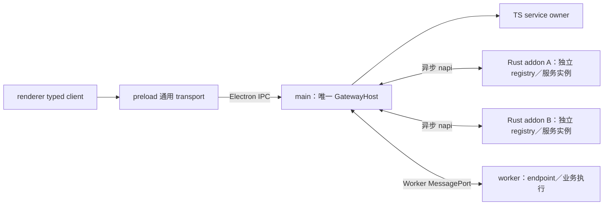

# Gateway 架构与运行机制

Gateway 统一服务寻址、强类型调用、响应流、事件和资源生命周期；业务 handler 与状态仍由所属模块持有。本文维护跨 TS、Rust、Electron 与 Node worker 的共同语义。包入口与开发命令见 [Gateway](../gateway/README.md)，语言 API 见 [TS](../gateway/ts/README.md) 和 [Rust](../gateway/rust/README.md)，验收入口见 [测试说明](../gateway/tests/README.md)。

## 架构与职责

[Contracts](../contracts/README.md) 独立定义消息、codec 和 service descriptor，不依赖 Gateway、业务实现或传输。Gateway 核心不包含数据库、配置、账号或网络业务；具体 owner 由宿主装配。多个 `.node` 动态库各自持有 registry 和服务实例，依赖同一 Rust crate 不会共享内存状态，也不生成单独的 Gateway `.node`。

Rust 本地命中直接执行，不进入 JS；未命中经异步 napi 回调请求 main 路由，main 只调用目标 endpoint 的 `dispatchLocal`。main 本地 TS 调用不绕行 Electron IPC。renderer 只持有 client 和句柄，不维护全局注册表；preload 仅暴露通用 transport。worker 持有执行状态和 endpoint，不创建第二个全局 host。

业务 handler 模块命名与源码消费规则见 [接入约定](../gateway/README.md#接入约定)，桌面启动、退出与依赖顺序见 [main 装配](../desktop/src/main/README.md#gateway-装配与生命周期)，页面调用与订阅见 [renderer 约定](../desktop/src/renderer/README.md#gateway-业务调用)。

## 调用与绑定

两端均使用 typed client／handler；具体绑定 API 见 [TS](../gateway/ts/README.md#调用与绑定) 和 [Rust](../gateway/rust/README.md#调用与绑定)。

route 名为 `package.Service.Method`，event 名为 message 的 PB full name。stream 通过独立的 stream API 执行，误用 unary 入口返回 `WRONG_METHOD_KIND`。现有字符串 ID 可使用两端 `parseId`／`parse_id` 显式转换为 bigint／u64。

控制版本和契约版本目前均为 1；每次调用检查 route 名、方法种类、输入／输出 message 名及版本。契约版本表示显式破坏性修订，不是 descriptor 指纹；兼容加字段不改变版本。实际消费端按 PB 解码，中转端原样转发字节；prost 消费后重新编码会丢弃未知字段，这不是转发端行为。

TS transport 返回普通 `{ ok: true, value } | { ok: false, error: { code, message } }`。本地 client 把失败包装为 `GatewayFailure`，传输不能依赖 Error 实例自定义字段。Rust 内部使用 `Result<Vec<u8>, GatewayError>`，适配器需映射为同一普通对象协议。错误至少区分未知 route、owner 不可用、参数错误、并发已满、超时、未授权、handler 错误；另有冲突、不兼容和方法种类错误。核心不记录业务 payload，未知异常使用固定错误信息。

## 注册与请求生命周期

TS main 持有唯一 `GatewayHost`；各 Rust 模块持有本地 `XwInvokeRegistry`；worker 仅持有固定本地 endpoint 与执行管理，不创建第二个 GatewayHost。`registerOwner`／`register_owner` 在同一批次中验证 routes 和 events，全部有效后才替换原 owner。批内重复、跨 owner 重名或无效策略不产生半注册状态。

每次替换创建新实例。关闭旧句柄不会注销新实例；旧连接投递和迟到响应不作用于新实例。TS 注册可注入 dispatcher，Rust 未命中时调用注入的 remote invoker；入口 `dispatchLocal`／`dispatch_local` 永远不回退，避免转发环。目标 host 未找到 route 立即返回 `UNKNOWN_ROUTE`。

执行 owner 按 route 限制在途 handler 并设置执行超时，满载立即拒绝；默认策略见 [TS execution](../gateway/ts/src/core/execution.ts) 和 [Rust invoke](../gateway/rust/src/invoke.rs)。转发端只跟踪 owner 生命周期，不再次限流或设置执行超时。超时或 owner 关闭会明确结束等待方；底层 handler 继续持有本实例的并发许可，直到真实完成。系统副作用不回滚，写操作不自动重试。

owner 重注册会使旧 pending 请求失败；新实例有独立执行状态，宿主不能把重注册当作取消旧系统任务的方法。

## 响应流

每流只允许一个在途 next；并行 next 返回 `CONCURRENCY_FULL`，不同流互不阻塞。open 不 poll producer，next 每次最多取一条；main 和 napi 不预读。流固定绑定原 owner 实例和 caller，上下文在嵌套开流中保留。跨 caller next／cancel 返回 `UNAUTHORIZED`；owner 替换不转移旧流，也不重试 next。

状态为 opening → active → ended／failed／cancelled。TS 在发送 open 前监听 abort；Rust napi 适配层在同步入口登记 open ID，取消不必等待开流或 next 完成。迟到的 open 会丢弃 producer，取消记录随对应请求结束释放。自然 end 后 next 返回 done，错误／取消后 next reject；终态只发生一次。`for await` break／异常通过 return 取消，显式 cancel 幂等。服务端终态清理句柄表，client 保留自己的终态，不在服务端积累 tombstone。

当前 TS／Rust 的活跃流默认并发上限如下；它限制同时占用执行名额的流数量，不是每秒请求数，超额开流返回 `RESOURCE_EXHAUSTED`，不排队。

| 配置 | 默认值 | 含义 |
| --- | --- | --- |
| `maxOwnerStreams`／`max_owner_streams` | 128 | 同一个服务 owner 的活跃流上限 |
| `maxCallerStreams`／`max_caller_streams` | 32 | 同一个调用方的活跃流上限 |

这两个数是实现时设置的框架资源保护默认值，当前没有记录对应的内存、连接数或吞吐量测算依据；不是 Pi、Node worker 或 napi 的技术要求，也不代表业务应采用的并发目标。它们不会根据负载自动调整。业务如需覆盖，应先明确资源预算和并发需求，而不是直接沿用或另选一组经验数字。

owner 可在 registration 的 `streamPolicy`／`stream_policy` 覆盖这些值，目前允许范围为 1–4096。统计位于实际执行环境；worker 内的上限不是跨所有 worker 的全局上限。取消／超时结束调用方等待，不代表尚未退出的执行立即释放名额。

完整默认值及校验规则见 [TS stream policy](../gateway/ts/src/core/stream.ts) 和 [Rust StreamPolicy](../gateway/rust/src/stream.rs)。限额还约束 chunk 字节、队列项数与字节及各阶段等待时间。TS ↔ Rust napi 接入会通过 manifest 公布 policy；[Rust napi 流句柄管理](../gateway/rust/src/napi/streams.rs) 另有独立句柄硬上限，提高 service 并发配置并不保证整条调用链能承载同样数量的流。

流不使用 unary 的整次超时。开流握手、pending next 的生产 idle、等待下次 pull 的消费 idle，以及 active 总时长分别计时；慢消费者不会触发生产 idle。远端开流成功后使用 owner 返回的 chunk／idle policy。

按 PB 编码后的长度计量；中转不解码或合并，typed adapter 每次只编码一条，执行 policy 约束实际 PB chunk。handler 不得预先缓存整个输出；Gateway 无法回收 handler 私自保存的对象或取消其任意外部任务。

主动源使用有界队列，必须 await send，满队列等待。队列同时受项数与字节限制，队列外最多还有一个待发送 chunk 和一个正在交付的 chunk；普通 pull 源无此队列。消费者取消后关闭本地 reader／丢弃 source，不保证远端外部服务停止执行或计费。

cancel 同步改变终态，再异步等待本地 producer 清理；显式清理有期限，超时明确报错。caller cleanup、owner close 使 pending open／next 明确失败并清理对应状态。本地 cancel 确认不等于远端副作用撤销；具体语言的资源释放边界见各模块 README。

## 事件

事件必须显式导出，filter 在源 owner 验证并匹配；中转层不解码 payload 或 filter。

每个订阅有自己的队列：Ordered 保留全部待投递事件，不用固定容量静默截断；Coalesce 替换为最后一个待投递状态；Drop 在已有待投递项时丢弃新项。正在执行的 sink 不算待投递项。事件是 best-effort、at-most-once；没有跨来源全序、历史补发或离线 payload 缓存。

普通本地订阅随源 owner 注销清理；显式 persistent 订阅只保留意图，源晚注册或替换后恢复，不补发离线数据。无效的晚到 filter 不会收到事件；调用者可关闭并重新订阅修正 filter。

订阅 handle 的 close 幂等。caller cleanup 清理本地及远端订阅。连接替换、caller 销毁与异步 attach 完成竞态时，旧结果只清理自己的 lease；迟到失败也不能删除新 lease。transport 的 close 应只操作其绑定实例。

## 权限边界

项目自有代码默认使用 `trusted: true`，包括 renderer、Electron main、worker 和 Rust 模块。可信调用可访问已注册的业务 route 和事件，不配置逐 route 白名单，也不因调用方位于 renderer 或 worker 而增加 backend-only、宿主专用或调用方身份限制。只有用户明确要求权限控制或配置白名单时，才为指定范围设置限制；不得因新增服务或接口涉及凭据而自行添加授权层。

默认可信不免除参数与业务校验、事务约束、流／订阅句柄归属检查及生命周期管理。窗口身份用于定向操作和资源清理，不作为限制自有业务调用的依据。业务分层是职责划分，不等于权限划分。

Gateway 保留不可信调用方的精确白名单能力；显式启用后，调用／开流与事件订阅分别按授权范围检查。自有代码默认可信的约定不意味着未来网络入口免认证，也不意味着自动导出所有本地能力。

宿主创建可信或精确白名单上下文；业务 payload 不能改变它，上下文不能通过反序列化或复制字段伪造。

注册、发布、上下文构造是宿主 API，不能暴露给 renderer 或不可信入口。handler 的嵌套请求使用注入 client 保留权限。直接加载的 Rust／JS 模块拥有所在进程的权限，此机制不提供任意第三方代码的沙箱；native 适配只允许宿主传入上下文；Electron ingress 由已注册的主 frame 和宿主分配的会话提供上下文；任意第三方代码的隔离宿主尚未实现。

## TS 与 Rust 的 napi 通信协议

该适配层通过 napi 连接同一进程中的 TS 与 Rust `.node` 模块，不是网络传输或线程间消息通道。代码入口为 `xiaowei-gateway/rust-napi` 的 `attachRustNapi`，endpoint 类型为 `RustNapiEndpoint`；文件名、导出与文档统一明确标注 Rust napi 边界。

manifest 在 endpoint 生命周期内保持固定。运行中新增／删除 route 或 event 时，用包含新 manifest 的 endpoint 重新接入同一 owner；走相同预留与发布流程，不直接修改已经发布的 native registry。业务服务实例可通过 Arc 保持其独立生命周期，但每个 endpoint 对应自己登记的 owner 实例。

原生接口包括 manifest、bind、activate、dispatchLocal、streamControl、subscribeLocal、unsubscribeLocal、deliver、close。main→native 只执行 dispatchLocal；native 本地未命中才回调 host。host 若发现 fallback 目标仍在来源 manifest 内，返回未知 route，避免重新转发给来源。调用时的权限由 host 创建 opaque token 并保留原上下文，native 嵌套调用沿用该 token；PB payload 不参与授权。

控制 metadata／manifest 用 JSON 字符串，控制版本为 1；请求、响应、事件和 filter 的 PB 字节直接用 Buffer，不编码为 JSON 数组或 Base64。native Promise 成功返回 Buffer，失败返回序列化的 `{ code, message }` 字符串；TS adapter 将其恢复为核心 Result。native 控制响应（如订阅策略）也有明确的编码，不与业务 PB 混用。`streamControl(control, payload, context)` 执行 `stream.open`／`stream.next`／`stream.cancel`；stream ID 和 route 位于控制 JSON，chunk 仍是二进制。

控制版本为 1。入站 native open 成功为空 Buffer；native→host open 返回编码在 Buffer 中的 policy JSON，让 Rust caller 使用相同的 chunk／idle 限额；next 的二进制帧为单字节 `0`（end），或 `1 + 大端 u32 seq + 原始 PB chunk`，seq 从 0 开始；error 使用原有结构化错误通道。序号异常和耗尽终止流，不重放；stream 对象不跨 FFI。host 维护上下文 token，流 ID 本身不提供授权。

## Worker 线程通信

Worker MessagePort 通信适配层通过专用 Node Worker 的 parentPort 连接 main 与 worker，不使用 napi，也不跨 Electron contextBridge。它支持 unary、响应流和保留来源权限的嵌套调用；事件能力暂不支持。接入、策略及关闭说明见 [TS Worker 接入](../gateway/ts/README.md#worker-messageport-通信适配层)。

service handler、执行配额、执行超时、AbortController、iterator 和实际清理归 worker；main 保留全局路由、授权、owner 生命周期及通信等待。worker 与 main 本地 handler 复用环境无关的 `ExecutionScope`，远端流通过独立 `StreamDispatcher` 接口挂载，main 不重复执行流 admission 或 producer 状态机。通信关闭并不提前释放仍在执行的 worker 任务许可。

## 远端服务与双向 WebSocket（尚未实现）

同一套 Gateway 调用方式可以覆盖远端 server。client／server 建立已认证的 WS 连接后，双方均可作为调用方和服务提供方，使用同一份 contracts 生成的 typed client 与 handler 接口。上层调用方式与本地服务一致，网络不可用、超时等结果仍明确返回，不伪装成本地调用必然成功。

职责分层：

- Contracts：接口、消息、event payload 和 stream chunk 的共同定义及语言产物。
- Gateway：owner／route 注册、寻址、invoke／event／stream 和服务生命周期。
- WS transport／连接管理层：认证、连接状态、请求／响应关联、超时、断线清理，以及订阅、流取消和背压的跨网络传播。
- 业务 handler：业务处理，不各自建立 WS 或维护连接状态；依赖业务在线状态时通过连接层接口获知。

连接建立且完成认证、契约及服务发布协商后，将显式导出的远端服务挂到对应连接 owner；断开时撤销可用状态，使在途请求／流明确失败并清理订阅和资源。重连使用新的连接实例标识，旧响应／旧 stream ID 不得影响新连接；可重新发布服务和建立订阅，但不自动重试写操作、重放事件或恢复 LLM 流，可靠恢复需业务专门设计。

WS 是双向传输，不自动提供应用层 RPC、取消或背压；复用并扩展 Gateway 控制语义，仍需有界发送缓冲、独立取消路径和 owner／caller 关联。请求 ID 需区分连接实例及调用方向，具体帧格式、心跳、重连退避和流量控制映射在远端实施前细化。

本地自有模块默认可信的约定不延伸为网络免认证。远端导出的 route／event 应显式声明并进行会话授权，不能因为共享契约或建立 WS 就把本机所有服务暴露给服务器，或把 Storage 原始数据库接口公开给任意客户端。反向调用同样受导出范围和会话权限约束。

本地与远端的路由作用域必须区分：面向 server 的 client 绑定明确远端 owner／目标，不能把任意本地未命中调用自动发送到网络，也不能让同名服务覆盖本地 owner。具体目标选择和多连接命名规则后续确定。

当前只实现本地 Electron IPC、napi 和 Worker MessagePort 链路，尚无 WebSocket transport 或 Go Gateway runtime。帧格式、心跳、重连策略和服务端接入须在后续事项中设计与验收。业务方选择 HTTP 或已认证 WebSocket 的要求见 [xwapi 后续传输设计](xwapi.md#后续-http-与-websocket-选择尚未实现)。

## 本地 socket 接入（尚未实现）

当前 renderer 与 main 的跨进程通信由 Electron IPC 承载；napi 连接同一进程中的 TS 与 Rust。当前未实现本地 socket transport 或独立 helper；Node worker 使用已有 MessagePort 适配。

后续若需要独立本地进程接入，可为 Gateway 增加本地 socket transport，复用核心的契约、服务注册、路由、调用和事件／stream 语义。提供接入能力不意味着必须将现有原生业务模块改为子进程。

届时参考旧版 host／studio 的 Unix domain socket、BridgeHub 请求响应关联与心跳、enrollment 接入认证、broker 服务归属与订阅管理，以及连接 epoch 和断线清理机制；按实际运行平台与需求确定传输和协议适配，不直接搬入旧版部署结构。连接准入与业务调用授权分别处理，旧会话的响应和资源不得影响新连接。

## 设计与验收记录

[Gateway 建设记录](../.agent/records/archived/2026-09-18-implement-gateway.md) 保留迁移理由、取舍和实施验收证据，不作为当前行为依据。跨平台、签名发布、远端 WebSocket、本地 socket 和不可信插件隔离宿主须分别验收；本地权限机制不提供第三方代码沙箱。
