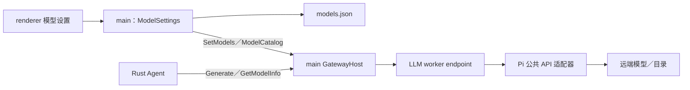

# LLM provider

桌面应用通过 Pi 调用远端模型。模型配置由 Electron main 管理，生成与模型目录请求在独立 Node worker 中执行；Rust Agent 通过 Gateway 调用，负责会话、工具执行和恢复。本文维护当前模型接入行为，建设理由和历史验收见 [LLM provider record](../.agent/records/archived/2026-09-24-llm-provider.md)。

## 模块与调用边界



main 保持唯一全局 GatewayHost；worker 持有本地执行 endpoint，复用 [Worker MessagePort 通信适配层](../gateway/ts/README.md#worker-messageport-通信适配层)。权限上下文与取消通过既有 Gateway 传递，不新增业务 IPC、raw napi 或独立 RPC。

| 位置（相对于 `desktop/src/main/services/llm/`） | 职责 |
| --- | --- |
| `config.ts` | 自有文件格式、校验、读取、原子写入、凭据解析及运行时转换 |
| `gateway.ts` | main 的 ModelSettings owner、持久快照、串行修改与应用状态 |
| `host.ts` | 创建／挂载／关闭 worker，提交完整模型快照 |
| `shared/` | 两侧共用的模型校验与配置 PB 转换 |
| `worker/index.ts`、`worker/gateway.ts` | worker 初始化及 Llm typed handlers |
| `worker/provider.ts`、`worker/apis.ts` | 请求编排、Pi 公共 API 选择、取消和清理 |
| `worker/messages.ts`、`worker/options.ts`、`worker/events.ts` | 领域消息、调用选项与流事件转换 |
| `worker/catalog.ts`、`worker/sse-observer.ts` | 远端目录与实际首 SSE 接收观测 |

Pi 类型留在模型适配层，自有配置与 Protobuf 不继承 Pi 类型。main 读取文件和环境变量，worker 只消费已解析的模型快照。业务执行配额、超时和流清理由 worker endpoint 持有；main 负责装配、授权和通信转发，不重复计算 service 配额。

Rust Agent 负责动态 system prompt、历史、工具声明与执行、权限、运行循环、重试／恢复和持久化；provider 只声明工具并传回调用结果。Agent 的当前范围与持久格式见 [Agent Chat](../.agent/records/active/2026-09-28-agent-chat.md)，不以一次模型生成的完成代表整轮 Agent 已完成。

## Gateway 接口

字段定义与接口注释以 [llm.proto](../contracts/proto/xiaowei/llm.proto) 和 [model-settings.proto](../contracts/proto/xiaowei/model-settings.proto) 为准。

| 接口／事件 | owner 与行为 |
| --- | --- |
| `Llm.Generate` | worker：根据稳定模型引用执行生成，返回领域事件流 |
| `Llm.GetModelInfo` | worker：返回 Generate 使用的同一已应用模型集合中的安全元信息 |
| `Llm.SetModels` | worker：整批校验后替换完整集合；空列表清空，在途请求保留旧快照 |
| `Llm.ModelCatalog` | worker：通过已配置模型引用或显式连接二选一拉取远端目录 |
| `ModelSettings.Get` | main：返回不含 API Key 的快照、可用性、revision 与应用状态 |
| `ModelSettings.SaveProvider` | main：保存完整提供方草稿，校验 expected revision 与 ID 归属 |
| `ModelSettings.DeleteProvider` | main：删除提供方，并清理失效的默认引用 |
| `ModelSettings.UpdateDefaults` | main：更新默认模型、小文本模型和默认思考等级 |
| `ModelSettings.GetAuxiliaryModelRef` | main：返回小文本模型引用，缺省表示未配置 |
| `ModelSettings.ListModels` | main：解析未保存的连接草稿及 Key 操作，转发 worker 目录流 |
| `ModelSettings.Reapply` | main：异常恢复时重提当前最新内存快照，不读取磁盘、不重放旧编辑 |
| `ModelSettingsChanged` | main：提交或应用状态变化后发布不含 API Key 的快照 |

模型配置不存入 Storage 通用 Settings，也不与服务端账号登录共享凭据。renderer 不直接调用 Pi；main 转发目录流时保留原调用上下文与取消。

## 生成请求与流事件

Generate 接受独立 system prompt，以及有序的 user、assistant、toolResult 历史；`userText` 是与完整 messages 互斥的单轮简写。图片以 MIME 与 bytes 传入，再转成 Pi 所需的 base64，模型须声明支持 image。工具参数 schema 只声明能力，不触发执行。

| 事件 | 消费约定 |
| --- | --- |
| `started` | 完整 messages 请求保留开始语义；单轮简写不补发完整文本块生命周期 |
| `textDelta`、`blockDelta` | 按 contentIndex 保留文本、thinking、toolcall 的交错顺序；索引不是工具计数 |
| `blockStarted` | 不携带已累积文本或中间 arguments；redacted thinking 可保留密文 |
| `blockFinished` | 完整块快照，不能再次作为增量追加 |
| `usage`、`finished` | 成功先发送用量，再发送唯一终态；finished.message 为权威完整回复 |
| `failed` | provider error／aborted 的安全业务终态，可保留部分内容和用量，不回传原始错误诊断 |
| `firstSseReceived` | 在可观测的 SSE API 上记录实际接收时刻，不把 Gateway 开流视为远端首响应 |

输入／资源校验、admission、授权及 Gateway 生命周期失败仍走 Gateway 错误通道，调用者须同时处理它与业务失败终态。流无终态结束按截断失败处理；deferred／pending 不作为正常完成，取消后不保证还能收到业务终态。SDK 自动重试关闭，避免与 Agent 的重试叠加。

工具 JSON delta 用于进度或累计原始参数，不能执行 partial.arguments；最终 argumentsJson 才是完整对象。assistant 回复保留来源 api／provider／model、时间戳、responseId／responseModel、有序内容、签名／redacted、用量与终止原因，可用于下一轮历史。不能仅从思考增量重建签名，不能用当前模型伪造旧回复来源；旧历史导入尚未实现。换模型／路由后的回放处理由 Pi 适配和 Agent 边界决定，不承诺跨模型密文回放。

用量保留 input、output、cacheRead、cacheWrite、totalTokens，以及存在时作为 output 子集的 reasoning。需要旧版含缓存输入口径时，使用 `input + cacheRead + cacheWrite`；reasoning 不再次累加。零值不能可靠区分“未报告”和“真实零”，模型目录 cost 是估算而非账单，不伪造 TPS 或耗时指标。

## 调用选项与资源限制

通用选项经 Pi `streamSimple` 调用，支持 temperature、maxTokens、reasoning／thinking budgets、工具选择、samplingParams、缓存、session、transport、SDK 超时和 metadata。`apiOptionsJson` 切换到协议专属 `stream`，与通用 reasoning／预算／工具选择互斥；只接受所选 API 的声明字段，不接受 Key、signal、fetch 或回调。强制工具选择使用协议专属 toolChoice。

模型 samplingParams 默认值与请求覆盖合并，不改变模型快照；具体参数、transport 和思考等级的效果由 Pi 与上游决定，不假定不同 API 等价。`off` 与缺省都使用 Pi simple 的缺省 reasoning 语义；需要显式关闭某协议的 thinking 时使用对应 apiOptions。thinkingLevelMap 以配置为准，不统一把 max 改成 xhigh。

| 限制 | 当前值／语义 |
| --- | --- |
| temperature | 未设置不传；显式范围 0–2 |
| maxTokens | 未设置使用模型有效上限；显式范围 1–模型上限；Pi simple 仍可能按上下文和 thinking 预算调整 |
| 单轮简写 prompt | system／user UTF-8 合计最多 256 KiB |
| 完整 Context | 转换后 JSON 最多 16 MiB |
| 累计生成增量 | 文本、thinking、工具 JSON delta 合计最多 1 MiB |
| 单事件 | PB 编码最多 1 MiB，包括终态签名和无 delta 的工具参数；超限为 RESOURCE_EXHAUSTED |
| 执行配额 | 沿用 Gateway 默认 owner 128／caller 32，是所在执行 scope 的框架保护，不是模型业务额度 |
| 流超时 | producer／consumer idle 各 30 秒，总时长 120 秒 |

取消接到 worker 内的 AbortController，结束迭代并清理监听与结果等待；owner 关闭沿用 Gateway 生命周期。Pi 内部仍有无界 push 队列，Gateway pull 与配额不构成严格的端到端背压，不承诺大输出的严格内存上界。

## Settings 模型配置与持久化

### 提供方与模型身份

提供方实例 id 和模型本地 id 在首次保存由 main 生成并持久化；编辑名称、上游 modelId、地址或凭据不改变这些 ID。Generate.model_ref 使用模型本地 ID，不使用名称拼接。modelId 在单一提供方内唯一，跨提供方可以相同；提供方名称 trim 后非空且唯一，同一预设可创建多个实例。

模型名称为空时显示 modelId，选择器显示 `provider_name/model_name`；协议层分别保留两个名称。修改协议／URL／Key 保留已添加模型；候选目录每次导入重新获取，不作为持久模型列表。默认模型、小文本模型和默认思考等级分别保存；删除模型或改变能力后清理失效引用和偏好。

提供方预设只展示当前 API Key／环境变量方式可用的入口，协议与 URL 组合按预设选择；自定义提供方支持 OpenAI Completions、OpenAI Responses、Anthropic Messages。底层适配器数量和具体协议见 [worker/apis.ts](../desktop/src/main/services/llm/worker/apis.ts)，存在适配器不表示其所有认证方式都已接产品或完成真实验收。

模型未填写或清空上限时，文件与 Settings 快照保持未设置，UI 用 placeholder 显示默认值；运行时分别补齐上下文 256,000、最大输出 32,768。显式值及预设／导入值优先，按有效值校验正整数和输出不超过上下文，不静默截断。reasoning 与 thinkingLevelMap 明确保存，关闭推理清除旧映射；兼容字段、samplingParams 和 cost 在普通编辑中保留，暂不提供 compat 编辑器。缺省零 cost 不代表真实免费。

自定义 Headers 忽略空白行，拒绝值非空但名称为空、大小写不敏感的重复名称。supportsWebSocket 默认 false，属于连接能力；transport 独立保存，http 映射为 sse，支持 WebSocket 且选择 auto 才设置运行时 auto。

### 凭据与可用性

合法 HTTP(S) URL、提供方名称及非空 apiKey／apiKeyEnv 名称至少一个为保存前提；模型列表允许为空。运行时非空环境变量值优先，否则回退文件 Key，均无值时不发送匿名请求。

只填写环境变量名仍可保存，即使当前进程尚无值。提供方条目保留并返回不可用原因，不把它提交 worker；其他提供方仍可用。环境变量取进程快照，不监听外部配置变化。

文件 API Key 明文保存，不接系统安全存储。编辑快照只提供 hasApiKey，保留／替换／清除通过显式操作表达，留空不能误当清除。API Key 不出现在返回列表、事件、日志和安全错误中；目录草稿可以提交新 Key，结果不回传 Key。

### 文件格式与路径

唯一加载器与格式定义在 [config.ts](../desktop/src/main/services/llm/config.ts)：

```text
ModelConfigDocument
├── version: 1
├── providers[]
│   ├── id, name, preset?
│   ├── provider, api, baseUrl
│   ├── apiKey?, apiKeyEnv?
│   ├── supportsWebSocket, transport
│   └── models[]
│       ├── id, modelId, name?
│       ├── input, reasoning, thinkingLevelMap?
│       ├── contextWindow?, maxTokens?
│       └── headers?, compat?, samplingParams?, cost?
└── defaults
    ├── modelRef?
    ├── smallTextModelRef?
    └── thinkingLevel?
```

默认文件为 `~/.xiaowei/models.json`；绝对路径 XIAOWEI_AGENT_HOME 改变 Agent 与模型共同根目录，XIAOWEI_LLM_CONFIG 可用绝对路径单独覆盖模型文件，优先于根目录。读写共用最终路径，不在 Electron 数据目录另存模型配置。

默认路径缺失得到空配置；显式覆盖路径缺失、坏 JSON 或格式错误报告失败，不覆盖原文件。不兼容旧 `{ models: [...] }` 输入。写入使用两空格缩进、末尾换行及稳定字段／列表顺序，同目录创建权限 0600 的临时文件后 rename 替换，失败清理临时文件。

### 保存与运行时生效

main 的 ModelSettings owner 串行处理修改，先校验 expected revision、生成候选、规范化并转换运行时模型，再写文件。文件失败丢弃候选，旧配置继续有效；写成功后发布持久快照并同步 worker。只在运行时模型变化或异常重试时 SetModels，默认偏好变化不重复替换模型。

worker 全量校验成功后替换模型集合，在途调用保留旧模型／Key 快照。保存后若 worker 退出或通信失败，保留已保存文件，返回“已保存但未应用”的应用状态；revision 与 applied revision 区分，不能伪报完全成功或回滚文件。Reapply 在同一队列重提最新内存快照，不读磁盘、不重放旧编辑。配置不监听文件，不提供常规重新加载入口。

## 远端模型目录

ModelCatalog 是可取消、分页的响应流，读取已配置模型引用或显式草稿连接，不修改模型配置。默认识别 OpenAI 兼容与 Anthropic 格式；DeepSeek 使用官方 `/models` 地址，不从生成协议推断所有服务都有兼容目录。调用方可指定兼容的 URL／format。

目录只返回上游实际提供的 ID、名称及可选能力，不猜测上限／价格。检查重复游标、跨 origin 的下一页和无效结果；禁止 HTTP redirect，错误使用安全通用提示。模型 ID 去重，Key 不进入结果。

## Responses WebSocket

沿用 `openai-responses`、base URL 和 API Key，通过 [Pi 补丁](../patches/README.md#pi-responses-websocket-补丁) 复用连接池与传输；应用仍调用 Pi 公共 Responses API，不依赖补丁内部 helper，不要求改成 Codex 后端地址或账号登录。

请求 URL 为现有 base URL 追加 `/responses`，WebSocket 只转换 HTTP(S) scheme；保留通用请求构造、headers、模型来源和计价。运行时默认 SSE；模型配置支持 WebSocket 且选择 auto 时优先 WebSocket，显式 Generate transport 可覆盖。

- 连接按稳定 sessionId、协议入口／provider、完整 URL 与有效握手 headers（含凭据）隔离。Agent 使用持久 SessionId，同会话跨轮稳定；连接池与续接基线只在 worker 内存中，应用重启后重新连接。
- 无 sessionId 时使用单次连接。忙连接或并发初次握手的额外连接为临时连接，不覆盖池内连接；凭据或连接参数改变后使用独立身份。空闲连接 TTL 为 5 分钟，最大连接年龄为 55 分钟。
- auto／websocket-cached 在非 input 参数一致、完整历史匹配“上轮输入加回复”且有新增输入时发送 previous_response_id 与 delta。基线每轮消费，仅成功终态建立下一份；历史／参数变化不复用旧基线。websocket 复用连接但发送完整输入。cacheRetention=none 不关闭连接复用。
- auto 仅在尚未发送 response.create 的连接失败时回退 SSE；websocket／websocket-cached 不回退。发送后的断线／超时直接失败，避免不确定上游是否执行时静默重发。
- 增量续接明确返回 previous_response_not_found，且尚未观察到正常响应事件时，才允许重连并以完整输入重试一次；不承诺跨连接持久续接。
- 取消关闭请求连接，不建立续接基线；成功归还后 abort 旧请求不影响下一轮。显式清理后的迟到归还不能留下池外连接，worker 关闭清理 Pi session resources。

连接复用只证明客户端到代理的传输，不推断代理到上游的实现。补丁升级必须核对隔离、并发、续接、取消与回退行为，不只验证补丁能否应用。

## 未交付能力与验证入口

当前认证仅 API Key／环境变量。OAuth、设备码、手动授权回填、特殊云凭据及其刷新／退出暂缓；本地模型、图片生成、deferred、文件监听、跨连接持久续接也未交付。Agent 工具循环属于 Agent Chat。已有 SDK 入口不等于这些产品能力已实现。

自动回归使用临时文件、测试凭据及本地 SSE／WebSocket fixture。LLM 与配置测试归 [desktop/tests](../desktop/tests/README.md)，补丁回归归 [patches](../patches/README.md)。真实 worker／Gateway 调用入口见 [桌面手动验收脚本](../desktop/scripts/README.md#真实-llm-调用)，它与应用共用 config.ts，不写回配置、不改变应用的 worker、不启动 Electron。

Node worker／napi 验证不能替代 Electron 应用包、签名与平台验收；并非所有 API、认证方式和补丁路径都有真实运行证据。已取得的证据与限制留在 [归档建设记录](../.agent/records/archived/2026-09-24-llm-provider.md#outcome)，后续实现变化持续更新本文。
