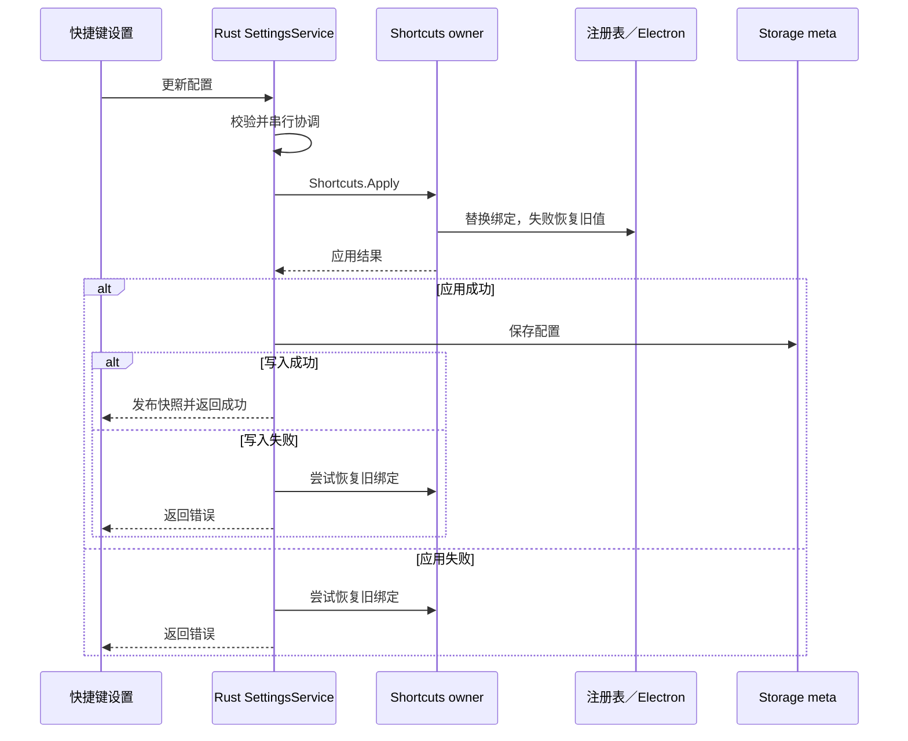

# 桌面快捷键

本文维护全局快捷键的配置、设置更新、原生注册与 Tray 菜单交接。Launcher 搜索行为见 [搜索](search.md)，快速对话的窗口内键盘行为见 [Quick Chat](../desktop/docs/quick-chat.md)。来源焦点与 Dock 策略暂由 [Tray、Dock 与焦点事项](../.agent/records/active/2026-09-28-tray-dock-focus.md) 承载，迁移及调度排障的历史依据见 [快捷键 record](../.agent/records/archived/2026-09-18-fixed-launcher-shortcuts.md)。

## 默认值与动作

| 配置项 | macOS 默认 | Windows／Linux 默认 | 动作 |
| --- | --- | --- | --- |
| `main` | Cmd+Space | Ctrl+Alt+Space | 切换当前 Launcher 模式的显隐 |
| `clipboard` | Cmd+Shift+X | Ctrl+Shift+X | 剪贴板入口 |
| `quickChat` | Cmd+Shift+C | Ctrl+Shift+C | 快速对话入口 |

同模式窗口已显示且聚焦时，快捷键隐藏窗口；其他情况显示并聚焦，模式专用快捷键还会切换到目标模式。主快捷键保留当前搜索／剪贴板／聊天模式。跨模式时先调整原生窗口尺寸，再通知 renderer；搜索基准高度 71px，剪贴板与聊天为 580px，搜索结果高度由布局接口另行调整。

Tray 左键和“搜索”菜单项只显示并聚焦当前模式，窗口已在前台时无操作；它们不采用主快捷键的 toggle 行为。Tray 的剪贴板与快速对话项复用模式入口。macOS 启动、Dock activate 和 second-instance 不回退显示 Launcher。

## 配置与更新

Rust SettingsService 提供默认值、校验、串行更新和持久化；Storage 数据库的 `meta` 表以 `setting.shortcuts` 保存含 `main`、`clipboard`、`quickChat` 的 JSON。main 宿主只接收设置快照、执行绑定，不另读数据库或为空值添加默认入口。

- 没有已保存配置时使用完整默认值。有效配置中的显式 `null` 表示未绑定；缺少 `quickChat` 字段也保持未绑定，以免覆盖旧配置。缺少 `main` 或 `clipboard` 字段则使用对应默认值；非法持久配置不覆盖默认快照。
- 每个组合包含 2～5 个不重复按键，修饰键在前，最后一个为支持的普通按键；后端拒绝组合重复。设置 UI 将录入的重复组合从原动作移除，实现绑定转移；清除后不再响应该动作。
- 更新先通过 Gateway 调用 `Shortcuts.Apply` 应用宿主绑定，成功后写数据库并发布 SettingsChanged；应用或写入失败时尝试恢复旧宿主绑定，失败可见。不会把尚未生效的快捷键当作保存成功。
- 宿主将按键代码转换为 Electron accelerator，例如 macOS 的 Meta 转为 Command、其他平台转为 Super，Key／Digit 去掉前缀，标点与方向键按映射转换。

## 注册与菜单交接

`services/shortcuts/registry.ts` 统一持有组合和回调。启动逐项注册，单项失败记录错误，继续注册其余项；设置更新则整体替换：先检查重复与动作是否存在，注销旧绑定，再注册目标配置。失败时移除部分新绑定并恢复旧绑定，恢复失败也记录错误。退出释放已注册项。

macOS 原生菜单 tracking 会延迟 Carbon 全局热键投递。Tray 打开菜单前暂时注销注册表中的全局绑定：可见菜单项展示并承担其 accelerator，其余绑定映射为允许快捷键生效的隐藏菜单项。菜单关闭后恢复注册表的当前内容；恢复操作可重复调用，已移除或已替换的旧回调不能执行，退出清理后不恢复已删除绑定。菜单期间新增加的绑定在下次打开菜单时进入菜单快照。

快捷键直接调用业务 action，事件通知由 Gateway DeliveryQueue 调度：Node 使用 `setImmediate`，浏览器使用 `queueMicrotask`。不在每个快捷键回调外另加延时、日志 I/O 或强制 UI 提交。实现约定见 [Gateway TS](../gateway/ts/README.md#事件与上下文)，原生回调与微任务检查点的调查依据保留于历史 record。

## 窗口定位与状态

首次 ready-to-show 与双击搜索框 Logo 使用鼠标所在屏幕的默认位置：工作区横向居中，顶部位于可用高度的 15%，不随面板高度变化。从隐藏唤起时，同屏保留拖动位置；跨屏时，默认位置映射到目标屏幕默认位置，非默认位置按工作区比例换算水平中心和顶部。位置不写磁盘，重启创建窗口后复原。

macOS 在创建窗口时一次性启用跨 Space 可见，并设置 `skipTransformProcessType: true`，Dock 由普通窗口管理，不在每次唤起时转换进程类型。隐藏到显示时捕获来源焦点，跨模式切换保留同一次来源；具体归还、取消和剪贴板粘贴确认见焦点事项。

renderer 的 LauncherOpened 订阅跨模式保持，通过 React effect event 读取最新状态；UpdateLayout 同步当前模式。进入或离开剪贴板会清空搜索，搜索与聊天之间切换不统一清空；聊天保留独立草稿与消息，重新显示聚焦 composer。

## 实现与验证入口

- [Rust Settings](../crates/xiaowei-storage/src/settings/mod.rs)：默认值、校验、持久化与更新协调。
- [快捷键设置](../desktop/src/renderer/src/components/settings/ShortcutSettings.tsx)：录制、清除与重复绑定转移。
- [宿主快捷键](../desktop/src/main/services/shortcuts/shortcuts.ts) 与 [注册表](../desktop/src/main/services/shortcuts/registry.ts)：转换、注册、回滚与菜单交接。
- [Launcher 唤起](../desktop/src/main/windows/launcher-shortcuts.ts) 与 [Tray](../desktop/src/main/app/tray.ts)：模式、定位及原生菜单。

验证入口见 [desktop tests](../desktop/tests/README.md) 与 [Storage 测试](../crates/xiaowei-storage/README.md)。模拟窗口与合成按键只能验证控制逻辑；真实组合键、跨 Space／多屏、系统菜单和焦点需要原生验证，历史证据与尚未逐项实测的边界保留于相关 record。
