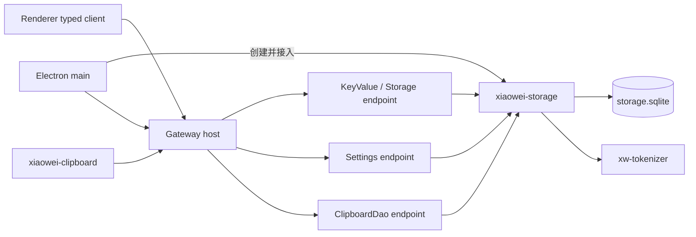

# 共享存储接入

本文描述桌面、Gateway 与 Rust 业务包如何共用 `xiaowei-storage`。连接、事务、迁移、meta 和 FTS5 注册的内部规则见 [Storage 数据库实现](../crates/xiaowei-storage/docs/database.md)；建设背景与验收结果见 [Storage record](../.agent/records/archived/2026-09-18-implement-storage.md)和 [FTS5 record](../.agent/records/archived/2026-09-24-fts5-search.md)。

## 所有权与调用边界

应用共享业务数据库由 main 创建的 Storage native 实例统一持有。多个 `.node` 即使依赖同一个 Rust crate，也不会共享其中的全局变量或连接池，因此业务通过 Gateway 调用同一服务实例，不各自建库。



- Storage 内部维护 SQL、迁移、meta、设置持久化及业务 DAO。
- 外部通过 typed `KeyValue`、`Settings`、`ClipboardDao` 和存储占用查询调用能力，不提交 SQL 或跨 RPC 的 begin／commit 句柄。
- 剪贴板负责系统采集、内容去重及附件生命周期，通过 `ClipboardDao` 读取和更新记录。
- main 负责路径、服务装配与宿主动作，renderer 使用生成的 typed client，不直接打开数据库。

Gateway 的寻址、权限与请求生命周期见 [Gateway 文档](../gateway/README.md)，服务装配见 [main 模块组织](../desktop/src/main/README.md#gateway-装配与生命周期)。

## 路径与数据归属

[paths.ts](../desktop/src/main/app/paths.ts) 从系统应用数据目录生成 `electronRootDir`，其下的 `xiaoweiRootDir` 保存应用业务数据：

```text
<系统应用数据目录>/com.tctony.xiaowei/xiaowei/
├── storage.sqlite
└── clipboard/
    ├── images/
    └── large_text/
```

Storage 接收 main 传入的数据库路径；剪贴板接收附件目录，数据库只保存相应元数据。删除、合并及附件释放的业务规则仍由剪贴板管理。`storage.sqlite` 与 WAL／SHM 文件属于数据库生命周期，不作为剪贴板附件处理。

账号服务器列表、选择和设备 ID 使用 `KeyValue` 保存到 meta；登录凭据另存 `auth.json`，不放入 meta。Agent 会话及模型配置有独立目录与存储，不能把共享 Storage 的单一实例约定扩展为所有模块只能使用一个 SQLite 文件。

## 启动与关闭

当前装配入口是 [createApplicationGateway](../desktop/src/main/app/gateway.ts)：

1. `Storage.open(databasePath)` 完成连接创建、tokenizer 注册、meta 自举与内部迁移。
2. 将同一实例的 KeyValue、ClipboardDao 和 Settings endpoint 接入 Gateway，再初始化依赖这些接口的业务。账号使用 KeyValue，搜索读取 Settings 中的书签开关。
3. 剪贴板 endpoint 接入后执行初始化，再启动采集，避免消费者先于持久化服务可用。

关闭先停止 Electron 请求入口，再关闭消费者和后台生产者；剪贴板先停止服务、关闭业务 endpoint 和历史实例，再关闭 Settings、ClipboardDao，最后关闭 KeyValue endpoint 及连接池。KeyValue endpoint 承担池关闭职责，其他两个 Storage endpoint 共用池，不能先关闭 KeyValue 再等待仍访问数据库的业务退出。

初始化失败时清理已经创建并接入的实例，保留原始错误；图标协议只在成功注册后注销。实际 SQL 或迁移失败会阻止当前初始化完成，不自动回滚已经提交的历史迁移。

## FTS5 与搜索分工

`xw-tokenizer` 提供通用分词和 SQLite 注册，Storage 确保每条池连接可用，具体 DAO 定义业务索引、同步和查询。当前剪贴板面板使用 FTS5；其索引字段、触发器、回填、过滤与召回规则仍维护在 [剪贴板 record](../.agent/records/active/2026-09-17-migrate-local-clipboard.md#剪贴板全文索引与召回)。

全局搜索由 `xiaowei-search` 的内存候选和 nucleo 提供，目前未调用剪贴板的 FTS5 召回接口，未实现对应的结果合并或重排。两种检索方式的边界见 [搜索实现](search.md#与剪贴板搜索的边界)。

## 验证入口

包内数据库验证见 [Storage README](../crates/xiaowei-storage/README.md#验证)，跨 addon 调用和启动／关闭故障注入见 [桌面测试](../desktop/tests/README.md)。自动验证使用临时数据，不依赖或修改用户数据库；真实实例检查与重启遵循仓库 AGENTS.md。
