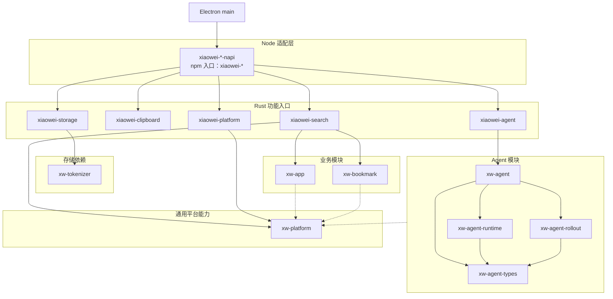

# 工作区详情

XiaoWei 包含 Electron 桌面应用、Rust 原生模块和独立 Go 服务端。桌面使用 TypeScript、React 和 Tailwind CSS，通过 napi 使用 Rust 能力，通过 Gateway 连接本地业务模块，通过 HTTP 访问 Go 服务端。

工作区组织、依赖同步与源码消费见 [包和依赖管理](package-management.md)。

## 模块与包

### 桌面应用

`desktop/` 是 Electron 应用包，主要分为 main 和 renderer。preload、worker、窗口、业务 service 等内部组织由对应模块文档说明。

| 模块 | 职责 | 详细说明 |
| --- | --- | --- |
| main | 应用装配、窗口与宿主能力，接入 Rust 模块和 TS 业务服务 | [main 模块组织](../desktop/src/main/README.md) |
| renderer | React 页面、组件、主题及业务调用适配 | [Renderer UI 开发](../desktop/src/renderer/README.md) |

### 共享契约与通信

`contracts/` 定义跨语言消息与接口，`gateway/` 提供调用、事件、响应流及传输适配。业务 handler 和状态由所属业务模块持有。

| 包 | 职责 |
| --- | --- |
| `contracts/ts/`：`xiaowei-contracts` | TypeScript 消息与 service descriptor |
| `contracts/rust/`：`xw-contracts` | Rust 消息与接口描述 |
| `contracts/go/` | Go 消息与接口描述，供独立服务端消费 |
| `contracts/tools/`：`xw-contracts-codegen` | 契约生成使用的 Rust 工具 |
| `gateway/ts/`：`xiaowei-gateway` | TS client、host 与 Node／Electron／worker 接入 |
| `gateway/rust/`：`xw-gateway` | Rust registry、typed binding 与 napi 通信适配 |

契约组织、生成与兼容规则见 [contracts](../contracts/README.md)，共同通信语义见 [Gateway 架构](gateway.md)，包与各语言接入见 [Gateway](../gateway/README.md)。

### Rust 模块

`crates/` 中的 `xiaowei-*` 是桌面使用的功能入口，`xw-*` 包含业务实现、支撑模块和通用能力。带 Node 接口的功能模块在自己的 `napi/` 下提供绑定 crate 和同名 npm 包；业务核心与适配层属于同一功能模块。

实线表示当前主要使用或依赖关系，虚线表示可按需使用的通用平台能力。契约、Gateway 与日志等共享依赖未逐一连线。

应用、书签等具体业务由各自的纯 Rust 模块实现。`xw-platform` 提供通用平台能力，可由 `xiaowei-platform`、Agent 模块及业务模块按需使用；`xw-tokenizer` 是 Storage 的单独依赖。

| 包 | 职责 |
| --- | --- |
| `xiaowei-search` | 全局搜索、排序与使用记录 |
| `xiaowei-clipboard` | 剪贴板采集、历史、资源与粘贴 |
| `xiaowei-storage` | SQLite 存储、迁移、设置与数据访问 |
| `xiaowei-agent` | Agent 核心与 Gateway／LLM 的集成入口 |
| `xiaowei-platform` | 原生平台能力的 Node 适配 |
| `xw-agent` | 会话、运行调度、持久化目录与业务恢复 |
| `xw-agent-runtime` | 单次生成执行、结果收集与取消 |
| `xw-agent-rollout` | 会话历史文件、提交与恢复 |
| `xw-agent-types` | Agent 内部领域类型、历史编解码与校验 |
| `xw-app` | 应用数据源 |
| `xw-bookmark` | 浏览器书签数据源 |
| `xw-platform` | 通用原生系统能力 |
| `xw-tokenizer` | Storage 使用的 SQLite FTS5 分词 |
| `xw-napi-log` | 原生模块日志接收 |

各包的详细说明、依赖方向及原生构建约定见 [Rust 模块索引](../crates/README.md)。

### 共享 npm 包

| 包 | 职责 | 详细说明 |
| --- | --- | --- |
| `packages/source-log/`：`@xiaowei/source-log` | 源码位置注入、日志运行时与 worker 日志采集 | [source-log](../packages/source-log/README.md) |

`packages/` 用于独立 npm 包；Rust 功能模块的 Node 入口留在所属模块中。

### Go 服务端

| 包 | 职责 | 详细说明 |
| --- | --- | --- |
| `server/`：Go 服务端 | HTTP 接口、用户与设备会话，使用 PostgreSQL 持久化 | [服务端说明](../server/README.md) |

Go 服务端独立运行，其内部模块、配置、数据库与部署方式由服务端文档说明。

## 工具和其他

| 目录 | 用途 |
| --- | --- |
| `scripts/` | 工作区开发、构建、检查与测试工具 |
| [`patches/`](../patches/README.md) | 第三方 npm 依赖补丁与行为回归 |
| `.github/workflows/` | CI 检查与测试 |
