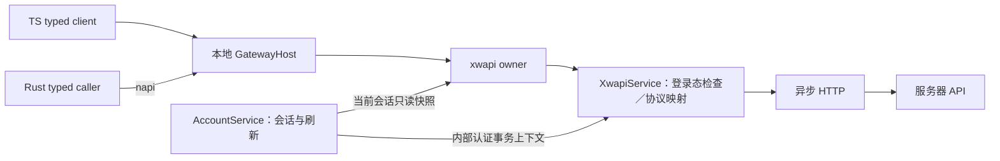

# xwapi 服务器调用

xwapi 是 Electron main 中的服务器 API service，经本地 Gateway 为 TS、Rust 等业务方提供强类型方法。它复用 server proto，统一 HTTP 映射、响应解码与登录态前置检查；AccountService 管理会话。服务端认证与 HTTP 语义见 [服务端契约](../contracts/proto/xiaowei/server/README.md) 和 [HTTP 文档](../server/docs/http.md)，本地通信语义见 [Gateway](gateway.md)。

## 模块职责与会话边界

HTTP 传输位于 [http.ts](../desktop/src/main/services/xwapi/http.ts)，强类型方法及鉴权配置位于 [service.ts](../desktop/src/main/services/xwapi/service.ts)，Gateway 接入位于 [gateway.ts](../desktop/src/main/services/xwapi/gateway.ts)。健康检查提供按需调用入口，不增加轮询。

xwapi 负责强类型 API 到服务器传输的映射、统一认证前置检查、公共响应解码和安全请求日志。账号模块继续持有服务器选择、设备身份和会话生命周期。app 装配创建一份 XwapiService 请求执行器供 AccountService 和 xwapi owner 使用；公共入口在每次调用时读取 AccountService.serverContext() 的会话快照，不复制状态或轮换 token。AccountService 内部恢复、刷新及未提交会话撤销提供自身会话快照与取消信号，同样执行 xwapi 鉴权；撤销迟到登录结果时使用该结果所属会话，不先公开未提交凭据。其他模块的服务器业务调用统一经 Gateway。

xwapi 只转发，由调用方管理会话。原始 Login／Refresh／Logout 调用成功不自动保存、替换或清除本地会话，不自动发出 AccountChanged；AccountService 继续负责现有产品登录流程。直接调用原始认证接口的消费者须处理结果对其会话的影响，不能把 xwapi.Login 成功等同于 Account 已登录。xwapi 不主动刷新或重试，刷新后的凭据由调用方提交到其持有的会话。

xwapi 当前在 TS main 执行异步 HTTP；编码、解码与业务校验在同一执行环境完成。当前没有 worker，后续若消息处理造成 main 事件循环延迟，再依据实测调整执行位置。WebSocket 尚未实现，后续约束见下文。

本地 Gateway 的调用方式与服务器侧网络传输分开：TS、Rust 使用同一套业务契约进入本地 xwapi；HTTP 路径、请求编码、超时及未来 WebSocket 连接细节由服务侧处理。服务器地址与访问凭据由本地会话管理提供，不通过普通业务请求任意覆盖。

公开路由直接复用 `xiaowei.server.auth.Auth` 的 Login、Refresh、GetCurrentUser、Logout，健康方法为 `xiaowei.server.common.Health.Check/Ready`；owner 为 xwapi。调用方使用生成 descriptor 和 typed client。原始成功响应保留完整 data，包括凭据；失败响应使用对应 PB 消息的 code/msg，缺少 data，不将业务 UNAUTHENTICATED 混为 Gateway 权限错误。接口原始结果的绑定分支原样返回，Account 登录流程只提交 authenticated 分支。

xwapi owner 关闭时注销公共路由、取消并等待真实在途 HTTP；AccountService 的内部事务仍使用自己的取消控制器，先结束其状态与补偿清理，再释放 Storage。Gateway unary 超时不等于底层请求取消；HTTP 沿用 10 秒超时，不承诺撤销已发送的副作用。

## 方法与登录要求

配置是 `service.ts` 中以生成方法 descriptor 为键的固定 HTTP 动词/路径映射，以强类型方法为依据。已配置的方法只有显式 `requiresLogin: false` 才免除普通登录态检查，省略该字段时默认需要登录；调用方不能覆盖此策略。未登记的方法返回 INTERNAL_ERROR，不发送网络请求。

| 方法语义 | 当前服务器入口 | 需要普通登录态 |
| --- | --- | --- |
| 登录 | POST /api/auth/login | 否 |
| 刷新凭据 | POST /api/auth/refresh | 否；仍须有效刷新凭据 |
| 当前用户 | GET /api/auth/me | 是 |
| 退出当前会话 | POST /api/auth/logout | 是 |
| 进程健康检查 | GET /healthz | 否 |
| 数据库就绪检查 | GET /readyz | 否 |

本地检查验证 sessionId、accessToken、会话服务器与目标服务器一致，以及 accessExpiresAtMs 晚于本地时钟；不依赖 Account 的 OFFLINE/RESTORING 展示状态。access 过期时 xwapi 拒绝发送，但不清除会话或断言必须重新登录。AccountService 保留既有刷新机制，先刷新并保存凭据，再发需要登录的请求。服务端仍负责最终认证，本地检查无法提前获知远端撤销。

本地拒绝使用现有公共错误码 UNAUTHENTICATED。日志记录安全的方法标识和拒绝原因分类，不记录 token、密码、请求体或响应体；未发送的请求不得记录为已发起 HTTP 网络请求。

## 健康检查契约

两个健康检查复用 `xiaowei.common.Empty` 输入和 [server/common.proto](../contracts/proto/xiaowei/server/common.proto) 中的 BaseResponse 输出；BaseResponse 只有 `code = 1`、`msg = 2`，无需专用 HealthCheckResponse。BaseResponse 同时表达成功与失败，code 为 0 表示成功；服务端错误响应继续使用它。服务端成功响应中的 `data.status = "ok"` 由本地校验，不重复传给业务方。HTTP 层只解析一次 JSON envelope，认证结果由生成 codec 解码，健康结果校验 status 后取 code/msg 解码；不使用全局忽略未知字段。

`/healthz` 检查进程可响应；`/readyz` 检查数据库可用，服务端探测超时为 2 秒。两者均可能返回 HTTP 200，调用成功与否按业务 code 判定，不能仅检查 HTTP 状态。增加调用能力不代表新增周期性健康轮询。

## 后续 HTTP 与 WebSocket 选择（尚未实现）

业务方未来可以在调用时选择 HTTP 短连接或 WebSocket 长连接。同一业务方法的请求、响应与错误语义尽量复用既有契约，传输选择属于调用机制，不混入服务端业务数据字段；具体跨 Gateway 的选择方式留到 WebSocket 切片设计。

WebSocket 必须在登录成功后建立并完成认证。无论方法本身是否标记免登录，只要选择 WebSocket，都必须满足连接级的登录要求；免登录方法配置不能授权未登录建连。登录等建立会话所需接口继续具备 HTTP 入口。

连接与账号会话关联；会话失效、退出或服务器切换时应清理旧连接，旧连接的响应不得污染新会话。临时断线只表示连接不可用，不直接清除仍有效的登录态。连接管理由统一模块负责，业务方不各自建立 WebSocket。

后续实施前需要明确：各方法支持的传输、未指定传输时的默认行为、已登录但连接尚未就绪或断开时的返回语义，以及超时、取消与在途请求清理。不预先实现占位 transport、无效配置项或自动回退；特别是不能在发送结果不明时擅自跨传输重试写操作。双向调用、连接实例隔离及远端导出边界遵循 [Gateway 远端设计](gateway.md#远端服务与双向-websocket尚未实现)。

## 接入与验证入口

TS 使用 `xiaowei-contracts` 的 Auth／Health descriptor，通过 `xiaowei-gateway` 的 `bindClient` 调用。Rust 使用模块生成的 typed Method，经注入的 Gateway client 调用；模块 service 依赖声明与生成流程见 [契约维护](../.agent/skills/maintain-gateway-contract/SKILL.md)。调用方必须检查业务响应 `code`；本地 transport 成功不代表服务器业务成功。

[main 装配](../desktop/src/main/app/gateway.ts) 创建请求执行器并注册 owner。公共入口的服务器与会话来自 AccountService，调用方不能通过 payload 替换它们或绕过登录策略。免登录方法不附加当前 access token；Refresh 的刷新凭据来自其强类型请求。

HTTP 当前要求状态为 200，禁止重定向，读取响应后按 UTF-8 字节检查 64 KiB 上限，并校验整数 code 和字符串 msg。非零 code 保留为业务错误，网络、取消、超时或无效响应映射为 UNAVAILABLE；公共 Gateway 方法将预期错误编码到对应业务响应的 code/msg。该响应大小检查发生在读取之后，不是流式读取限额。

日志字段、等级与敏感信息规则统一见 [请求日志](../server/docs/http.md#请求日志)。自动回归分别位于 [main xwapi 测试](../desktop/tests/main/xwapi.test.ts) 与 [Rust napi xwapi 测试](../desktop/tests/rust-napi/xwapi.test.ts)，运行方式见 [桌面测试](../desktop/tests/README.md)。[建设记录](../.agent/records/archived/2026-10-07-xwapi-service.md) 保留取舍及自动、现场验收证据，不作为当前行为依据。
