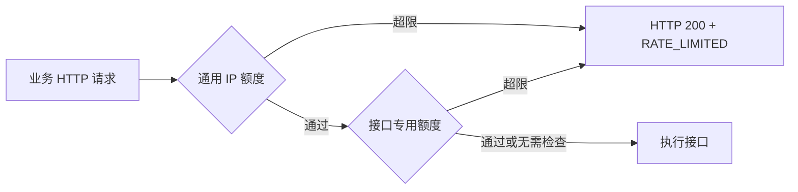

# 请求限流

限流由 Go HTTP 接入层负责，消息中的 RATE_LIMITED 定义见 [服务端契约](../../contracts/proto/xiaowei/server/common.proto)。限流计数在单个服务进程的内存中维护，不引入 Redis；重启清零，不影响数据库中的用户或会话。

## 覆盖范围与检查顺序

所有业务 HTTP 请求先按来源 IP 检查共享的通用额度，再检查该接口的专用额度；没有专用额度的接口只执行通用检查。通用额度按 IP 汇总，不为每个接口分别分配一份。

GET /healthz、GET /readyz 不计入业务额度，避免业务流量使正常探针被限流。未知路径和错误方法仍计入通用额度。WebSocket 建连后的消息需要另行设计限流，不由 HTTP 请求计数覆盖。按账号、发邮件等限流随对应业务接入，不在本次实现。



通过通用限流后即占用一次额度，即使后续业务失败或专用限流拒绝，也不退还。通用超限时不再消耗专用额度。登录的 IP 与邮箱加 IP 两项专用额度同时检查，任意一项超限时不单独消耗另一项。

超限返回 HTTP 200 和非零 RATE_LIMITED 码，不返回 data；Retry-After 响应头提供建议等待的秒数，向上取整。HTTP 响应规则见 [HTTP 接口](http.md)。

## 配置

以下为 YAML 配置及默认值；旧配置省略这些字段时使用默认值：

```yaml
server:
  rate_limit:
    ip:
      limit: 300
      window: 1m

auth:
  rate_limit:
    login_ip:
      limit: 30
      window: 1m
    login_email_ip:
      limit: 5
      window: 15m
    refresh_ip:
      limit: 60
      window: 1m
```

通用额度默认每 IP 每分钟 300 次；登录与刷新沿用当前默认值。普通接口无需逐个配置，自动受到通用限流保护。

沿用全局配置优先级：内置默认值 < YAML < 同目录 .env < 外部进程 env。限流字段支持显式环境变量覆盖，完整键名见 [环境变量模板](../config/.env.example)；启动时读取，修改后重启生效。limit 和 window 必须大于零，零值不能隐式关闭限流。内部容量与清理周期保留为实现细节，不对外增加配置。

## 计数与来源

当前限流器使用固定时长窗口，从该键第一条被接受的请求开始计时，窗口到期后重置。它不保证窗口边界附近的请求被平滑分布；当前先复用现有算法。

同一来源 IP 可代表多个共享出口的客户端，额度由部署者按实际流量调整。来源只取 RemoteAddr，并规范化 IP，不信任客户端提交的 X-Forwarded-For；可信代理的配置和识别留到部署接入时确定。邮箱先规范化再参与专用键，内部使用哈希避免明文邮箱作为计数键。device_id 不作为身份凭据或通用限流依据。

计数器通过互斥锁保证并发检查与计数一致，周期性清理过期键，并限制最大键数。容量耗尽时拒绝新键对应请求，返回限流与重试提示，避免计数状态无限增长。
